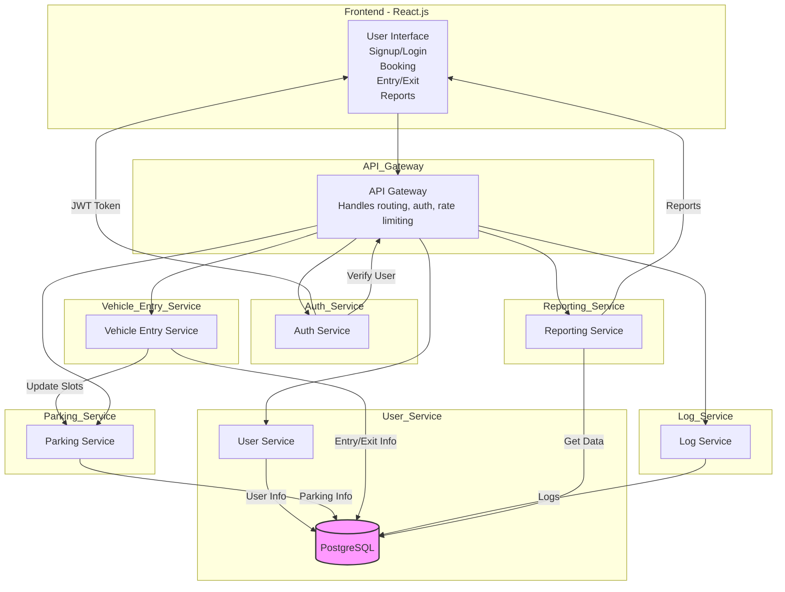

```mermaid

graph TD
  subgraph Client_Side [Frontend - React.js]
    A1[User Interface\nSignup/Login\nBooking\nEntry/Exit\nReports]
  end

  subgraph API_Gateway
    B1[API Gateway\nHandles routing, auth, rate limiting]
  end

  subgraph Auth_Service
    C1[Auth Service]
    C1 -->|JWT Token| A1
    C1 -->|Verify User| B1
  end

  subgraph User_Service
    D1[User Service]
    D1 -->|User Info| DB[(PostgreSQL)]
  end

  subgraph Parking_Service
    E1[Parking Service]
    E1 -->|Parking Info| DB
  end

  subgraph Vehicle_Entry_Service
    F1[Vehicle Entry Service]
    F1 -->|Entry/Exit Info| DB
    F1 -->|Update Slots| E1
  end

  subgraph Log_Service
    G1[Log Service]
    G1 -->|Logs| DB
  end

  subgraph Reporting_Service
    H1[Reporting Service]
    H1 -->|Get Data| DB
    H1 -->|Reports| A1
  end

  A1 --> B1
  B1 --> C1
  B1 --> D1
  B1 --> E1
  B1 --> F1
  B1 --> G1
  B1 --> H1

  style DB fill:#f9f,stroke:#333,stroke-width:2px

```